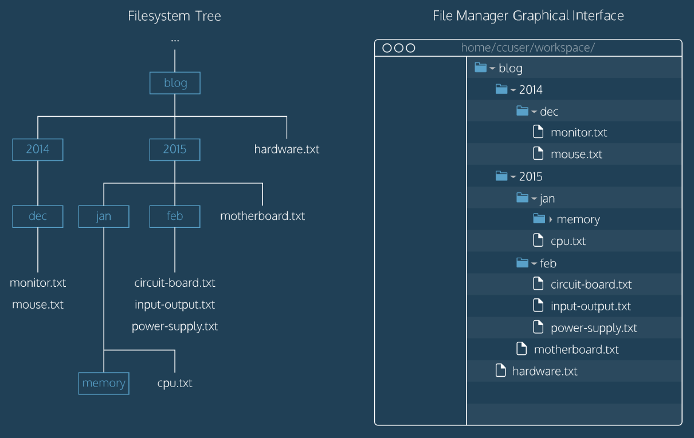

# I sistemi operativi 

## Cos'è un sistema operativo?
Il **[sistema operativo](https://it.wikipedia.org/wiki/Sistema_operativo)** (**SO**) è un **[software](https://it.wikipedia.org/wiki/Software)** di sistema che si frappone fra la parte hardware e la parte software il cui scopo principale è quello di gestire le risorse di elaborazione e rendere agevole l’interfaccia uomo-macchina. I primi sistemi operativi sono nati negli anni ‘60 con [Unix](https://it.wikipedia.org/wiki/Unix), il quale storicamente è stato il sistema operativo maggiormente utilizzato su sistemi mainframe.
I moderni sistemi operativi hanno più moduli che garantiscono una funzionalità molto diversa rispetto agli anni passati.

#### Kernel

Il **kernel** costituisce la chiave di un sistema operativo, ovvero il software che fornisce un accesso sicuro e controllato dell'hardware ai processi in esecuzione sul computer. Dato che possono eventualmente esserne eseguiti simultaneamente più di uno, il kernel può avere anche la responsabilità di assegnare una porzione di tempo-macchina (**scheduling**) e di accesso all'hardware a ciascun programma (**multitasking**). In parole semplici, per il SO, esso è il nucleo che gestisce ogni cosa.

#### Principali attività svolte dal sistema operativo

Oltre al kernel tra le componenti principali delle attività svolte dal sistema operativi vi è:  
* la gestione della RAM e la gestione della memoria di massa 
* la gestione del file system 
* lo scheduler che gestisce i processi.

## Processi

### Gestore dei processi

Il **gestore dei processi** varia da sistema operativo a sistema operativo. Esso è il modulo che si occupa di controllare la sincronizzazione, l’interruzione e la riattivazione dei programmi in esecuzione cui viene assegnato un processore. 
La gestione dei processi, inoltre, viene compiuta in vari modi in funzione dal tipo di utilizzo cui il sistema è rivolto.

#### Scheduler

C’è all’interno del gestore dei processi un componente importante chiamato **Scheduler**. Tale componente stabilisce un ordinamento temporale per l’esecuzione dei processi richiesti, privilegiando quelli che rispettano determinati parametri secondo una certa politica di scheduling, in modo da ottimizzare l’accesso a tale risorsa e consentire l’espletamento del servizio/istruzione o processo desiderato. 

#### Politiche di scheduling:

* **Preemptive**: la CPU in uso da parte di un processo può essere tolta e passata ad un altro in un qualsiasi momento. Windows 10 è un SO preemptive, in quanto possiede l’autorità di interrompere un processo. 

* **Non-preemptive**: una volta che un processo ha ottenuto l’uso della CPU non può essere interrotto fino a che lui stesso non la rilascia.

Il sistema operativo deve gestire un’infrastruttura denominata **File System** oltre che a gestire l’interfaccia utente, garantire l’accesso simultaneo di più utenti alla stessa macchina e l’esecuzione simultanea di più processi. È compito di un processo scrivere su una memoria di massa il mio file.

#### Sistemi monotasking e sistemi multitasking

I sistemi operativi possono essere divisi in due diverse categorie in base a come questi gestiscono l’esecuzione dei processi:

* **Sistemi monotasking**: sistemi operativi che gestiscono l’esecuzione di un solo programma per volta. Esempio: viene eseguito prima il processo A (completamente), dopodiché il processo B, successivamente C e così via. Un esempio di sistema operativo di questo tipo è MS-DOS.

* **Sistemi multitasking**: sistemi operativi che gestiscono l’esecuzione di più processi in simultanea. In questo caso l’esecuzione di un singolo processo è rallentata a causa dell’esecuzione contemporanea degli altri processi, ma sommando tutto, questo modo di gestire i processi permette di guadagnare tempo.

#### Time-sharing

Il **time-sharing** è un modo attraverso il quale l’esecuzione delle attività di elaborazione centrale viene suddivisa in quanti o intervalli temporali. Ogni quanto è assegnato sequenzialmente a vari processi di uno stesso utente o a processi di più utenti

#### Thread

 Il **Thread** è una suddivisione di un processo in due o più filoni (istanze) o sotto processi che vengono eseguiti concorrentemente da un sistema di elaborazione monoprocessore (multithreading) o multiprocessore o multicore

 #### Quali sono i vantaggi nell’implementazione dei Thread in un SO? 

 Il fatto che questi riescano a gestire un sottoinsieme di processi per migliorarne la prestazione. Mi occupano quindi porzioni di memoria per generare un’attività indipendente.

 ## Memoria

#### RAM

Il termine **RAM** sta per (memoria ad accesso casuale) è un tipo di memoria volatile caratterizzata dal permettere l'accesso diretto a qualunque indirizzo di memoria con lo stesso tempo di accesso.

#### Memoria di massa

La **memoria di massa** è un tipo di memoria che raccoglie tipicamente grandi quantità di dati rispetto alla memoria primaria e in maniera non volatile cioè permanente almeno fino alla volontà dell'utente.

### Gestore della memoria

Il **gestore della memoria** è un componente del sistema operativo dedicato alla gestione della memoria primaria disponibile sul computer. Il gestore si preoccupa di allocare, deallocare e gestire la memoria che viene assegnata agli applicativi e allo stesso sistema operativo.

La sua complessità dipende dal sistema operativo. Nei sistemi multitasking possono essere caricati in memoria più programmi contemporaneamente.

Tuttavia quando aumentano i processi e tutti chiedono memoria, arrivo a una situazione in cui lo spazio fornito dalla memoria centrale non basta più.

Quindi la domanda che sorge spontanea è: come allocare spazio in memoria in maniera ottimale? 
La risposta più semplice a questa domanda è: con la **memoria virtuale**. 

#### Memoria virtuale

La memoria virtuale è un’architettura capace di simulare uno spazio di memoria centrale maggiore di quello fisicamente presente o disponibile. In questo modo vengono mantenuti nella memoria di sistema (RAM) solo le parti di codice e dati che servono solo in quello specifico momento.

#### Swap

Lo swap è l’estensione della capacità della memoria volatile complessiva nel computer. 

I dati dei programmi non in esecuzione della memoria centrale possono quindi essere parcheggiati nell’area di swap.

## File System

Lo scopo iniziale per cui erano nati era quello di salvare i file in una struttura ad albero. La prima funzionalità offerta era quella di garantire all’utente la scelta dell’estensione di ogni singolo file da salvare. 

### Gestore del File System 

E' un modulo incaricato di gestire informazioni memorizzate su dispositivi.

Nei moderni sistemi operativi, oltre all’integrità, sono state aggiunte delle misure di sicurezza: sono stati definiti degli attributi a cui posso assegnare dei permessi a certi utenti. 

Tutti i sistemi operativi garantisco due livelli di utenza: **amministrativo** e **utente**. In Windows la struttura riservata all’utente si chiama “Profilo utente”.  Nascosto in ogni profilo utente c’è un file denominato NTUSER.DAT che Windows carica, modifica e salva automaticamente. Questo file contiene le impostazioni e le preferenze per ciascun utente.

Il gestore del File System, nei sistemi multi-utente, deve mettere a disposizione dei meccanismi di protezione in modo tale da consentire agli utenti di proteggere i propri dati dall’accesso da parte di altri utenti non autorizzati. 

Ma nonostante i permessi io ho anche la possibilità di accedere ad un disco fisso bypassando i sistemi di sicurezza attraverso l’uso di un sistema operativo terzo.

#### Disco fisso

Un **disco fisso** (o **disco rigido**) non è fatto di cartelle di file, ma ha una struttura logica fissa che rende flessibile l’interazione uomo-macchina.

Esso è un dispositivo di memoria di massa di tipo magnetico che utilizza uno o più dischi magnetizzati per l'archiviazione di dati e applicazioni.

## Altre caratteristiche generali di un sistema operativo

#### Dispositivi I/O

Il gestore dei dispositivi I/O è quel modulo del SO incaricato di assegnare i dispositivi task che ne fanno richiesta e controllare i dispositivi stessi.

#### Plug and play

Usata in diversi contesti con riferimento a tecnologie che possono essere messe in uso all’interno di un sistema hardware e/o software senza che l’utente del sistema operativo conosca o metta in atto una specifica procedura di installazione o configurazione.

#### Interfaccia utente

L’**interfaccia utente** è nata coi primi sistemi operativi con lo scopo di far in modo che l’uomo possa facilmente interagire con la macchina.

* **Interfaccia testuale** (**shell**): interfaccia che mette a disposizione un interprete di comandi. Nei moderni sistemi operativi si tende a fornire una shell sempre più potente che facilita sempre di più l’interazione uomo-macchina. 

* **Interfaccia grafica** (o **GUI**): interfaccia a finestre arrivata dopo l’avvento del personal computer, in cui l’input e l’output dei programmi viene visualizzato in maniera grafica e facilmente comprensibile all’utente (user-friendly). L’utente che lavora su interfaccia grafica in genere si serve del mouse. Questo, inventato per la prima volta per [MacOS](https://it.wikipedia.org/wiki/MacOS), si tratta di un ottimo strumento che interagisce con le finestre.

#### Sistemi operativi commerciali e Open-Source

I sistemi operativi si dividono inoltre in due macro categorie riguardo alla disponibilità di utilizzo:

* **Sistemi operativi commerciali**: (esempio Windows) essi fanno parte di un sistema chiuso in cui deve essere prima pagata una licenza per l’utilizzo. La società è quindi responsabile del rilascio del software e del codice. Microsoft, proprietaria di Windows, ha attuato questa linea di business per i loro prodotti, anche se ultimamente il livello di apertura di Microsoft sta cambiando e molti codici sono stati resi condivisibili. 

* **Sistemi operativi open-source**: in questi sistemi operativi tutto il codice con cui è fatto il sistema operativo è aperto a tutti e io posso reperire tutte le componenti che desidero senza alcun vincolo. Nel mondo di Linux ci sono prodotti (non-enterprise) in cui non forniscono alcun tipo di supporto e prodotti Red Hat (enterprise), cioè legati a un’azienda in cui per ottenere supporti di un certo tipo deve essere pagata una sottoscrizione (non propriamente una licenza). 

#### In che linguaggio è scritto un sistema operativo?

Un sistema operativo è formato da tante parti. In generale, la parte “più vicina” all'hardware è scritta in **linguaggio Assembly**. Questa però è soltanto una piccola porzione. Tutto il resto è principalmente scritto in un linguaggio di tipo compilato e il più usato è senza dubbio il **C**. La maggior parte dei Linux sono scritti in C. 

#### Firmware
Insieme di istruzioni e delle applicazioni presenti permanentemente nella memoria di un sistema e che non possono essere modificate dell’utente. 


## Processo di avvio di un sistema operativo

#### Boot
Insieme dei processi che vengono eseguiti da un computer durante la fase di avvio. Il sistema operativo viene caricato nella RAM all’accensione della macchina e rimane attivo fino allo spegnimento.  

#### Ma quali sono i processi che permettono l’avvio del sistema operativo sul mio pc? 

* Area del disco fisso in cui faccio partire il sistema operativo: **master boot records**

* Dopodiché incomincia a caricare il **kernel** del sistema operativo che viene caricato nella **RAM** con una sequenza di ordine di processi che variano da sistema operativo a sistema operativo 

* Infine verrà caricata un'interfaccia grafica, la quale fornirà un prompt di accesso 

#### BIOS

E' un software con una configurazione persistente ed è il primo programma che viene eseguito dopo l'accensione, coinvolto pertanto nella fase di avvio (boot) del sistema di elaborazione. Esso ha quindi i compiti di vedere l’hardware e innescare un processo di avvio del sistema operativo. 

#### Posso installare più sistemi operativi nella stessa macchina?

La risposta è sì. Per fare questo andrò a partizionare il mio hard-disk e all’avvio un programma, denominato **boot loader**, mi darà un'interfaccia che comunicherà all’utente quale sistema vuole far partire. La pecca di questo approccio è che mi causerà un grosso dispendio di memoria e calo prestazionale perché entrambi i SO convivono attualmente sullo stesso pc. 

Una buona alternativa è quella di lasciare un unico sistema operativo nella macchina e immettere sistemi operativi secondari in macchine virtuali. Quindi utilizzare un programma di virtualizzazione che mi permette di tenere tanti SO diversi nello stesso pc. Il sistema operativo nella mia **macchina virtuale** (**virtual machine** o **VM**) verrà attivato come se fosse normalissimo programma. La connotazione più importante nel momento in cui installo una macchina virtuale è che questa baserà le sue prestazioni su dei processi, non sul sistema operativo in sé. In questo modo posso quindi scegliere il mio SO e attivarlo sopra il mio pc, il quale esso stesso non si renderà conto dei due sistemi operativi attivi, ma sarà come se stesse girando un programma qualsiasi. È consigliabile utilizzare solo il sistema operativo della mia virtual machine una volta che questa è stata accesa, altrimenti il pc si rallenta molto.

<!--
### $ ls
``` sh{1,3,5,9}
ls # Comando per vedere la lista dei files presenti nella cartella attuale
# file1 file2 directory1
ls -a # Visualizza anche i files nascosti (che iniziano sempre con un '.', detti dot-files)
# . .. file1 file2 directory1
ls -t # Visualizza più dettagli, come i diritti di scrittura, la data di creazione, l'autore...
# drwxr-xr-x  2 handgull handgull 4096 feb  4 12:24 file1
# drwxr-xr-x  3 handgull handgull 4096 feb  4 11:44 file2
# drwxr-xr-x  4 handgull handgull 4096 feb  3 14:42 directory1
ls -alt # Si possono combinare tutti i parametri
```
:::tip
La **shell prompt** appare quando il terminale è pronto a ricevere gli input, può cambiare aspetto differente da terminale a terminale, ed è personalizzabile.<br>
(vedi ~/.bashrc e $PS1 nella sezione linux).<br>
l'opzione `-t` ordina la lista risultante da quello modificato più recentemente.
:::

## Filesystem

Un filesystem organizza i files e le directories(cartelle) in una **struttura ad albero**:



1. La prima cartella del FS(filesystem) è la **root directory**, ed è la cartella da cui derivano tutte le cartelle e file del FS.

2. Ogni cartella padre può **contenere** più files/directory. Ad esempio nell'immagine sopra `blog/` è padre di `2014/`, `2015/` e `hardware.txt`

### $ pwd
``` sh
pwd # Comando per vedere il path in cui ci si trova, ovvero la cartella ed i suo percorso
> /home/handgull
```
:::tip
**pwd** = Print working directory. Nell'esempio sopra la Working directory è `handgull`<br>
:::
`ls` e `pwd` sono quindi utili comandi del terminale per capire "dove ci si trova"

### $ cd
``` sh
cd <path> # Comando per spostarsi all'interno della cartella
cd .. # Comando per spostarsi nella cartella padre
```
:::tip
**cd** = Change direcory. In altre parole con `cd` possiamo cambiare la Working directory.
:::
:::tip
Negli esempi sopra è stato passato un **parametro** al comando cd
:::
### $ mkdir & $ touch
``` sh
mkdir <name> # Crea una cartella all'interno della Working directory
touch <name> # Crea un file vuoto nella Working directory
```

### .iso
I file .iso (file immagine che contiene l'intero contenuto di un disco ottico, in genere con un file di questa estensione posso installare il mio sistema operativo sia direttamente nel mio computer, sia in una macchina virtuale come vedremo in seguito) sono generalmente costituiti da un insieme di moduli.

### Filesystem: esercitazione

[GO!](./exercise-bicycle-world.md)

-->