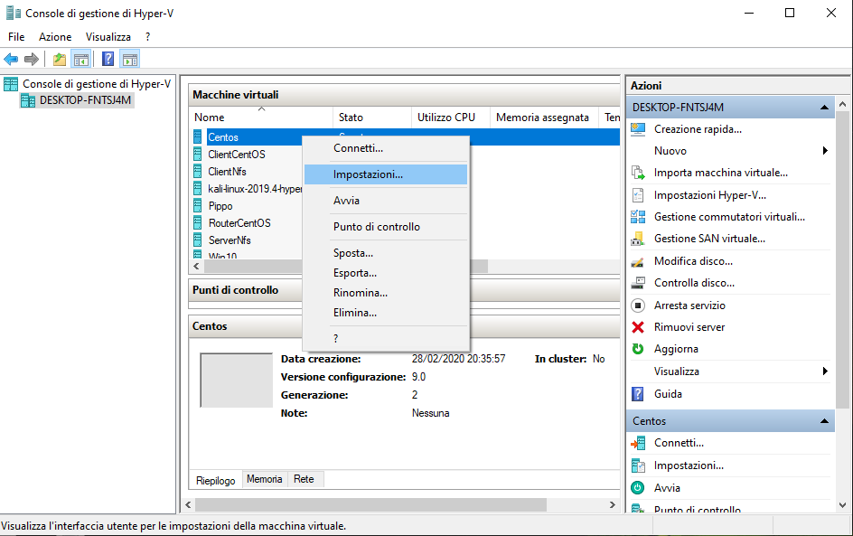
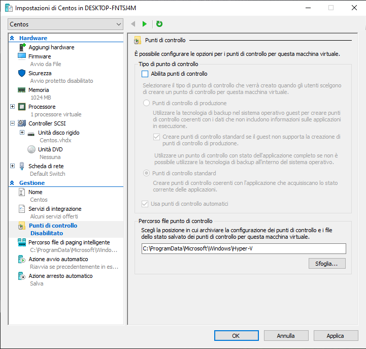
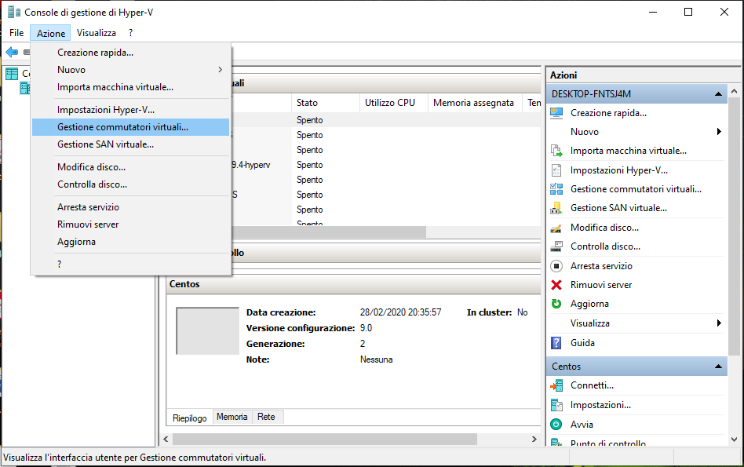
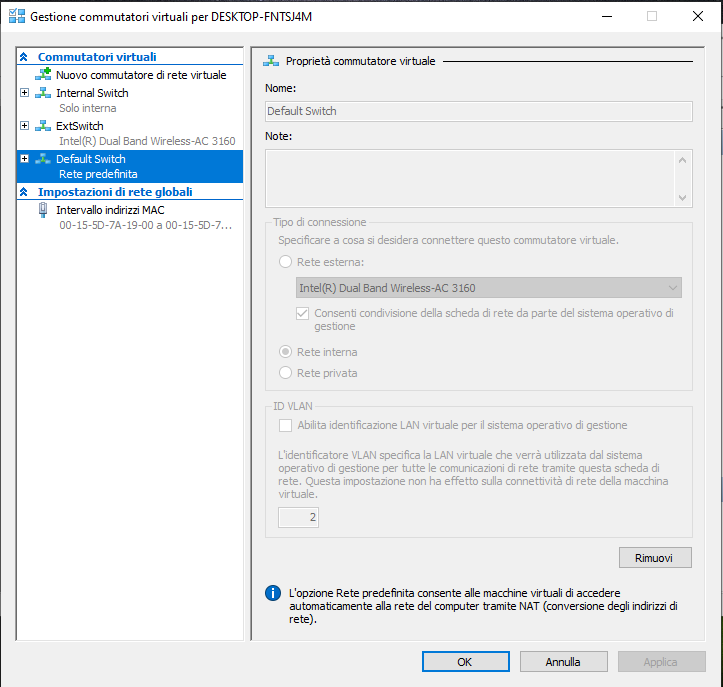
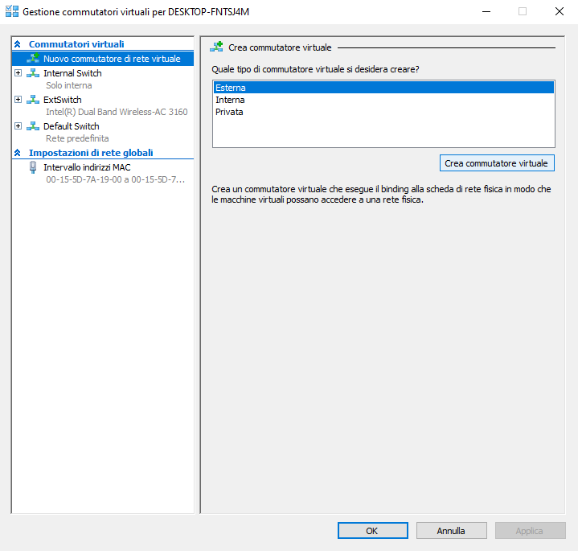
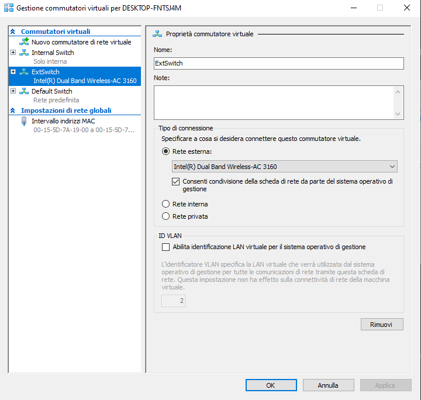
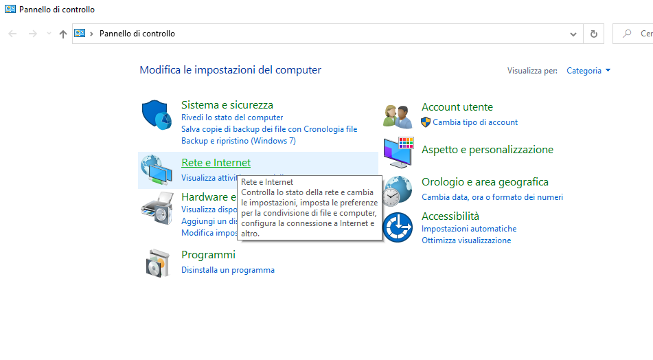
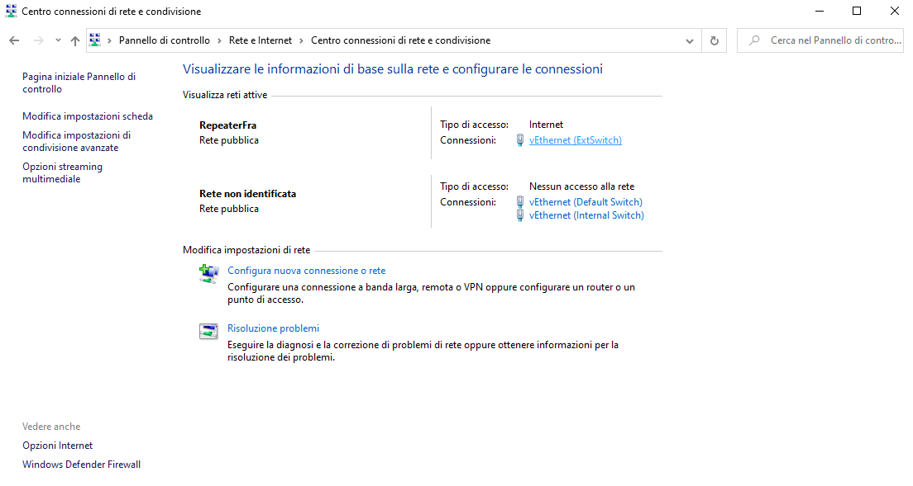
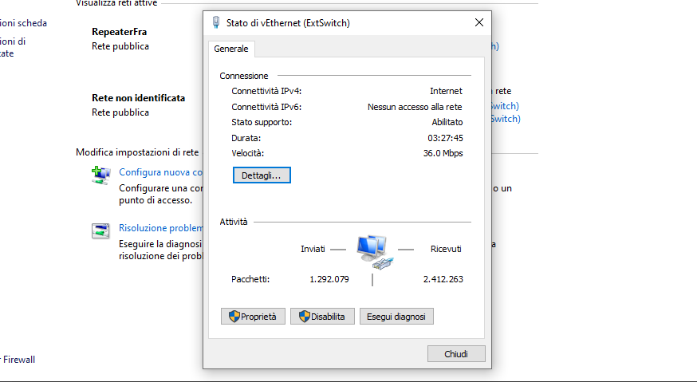

# Hyper-V: punti di controllo e schede di rete

## I checkpoint di Hyper-V

Uno dei principali vantaggi della virtualizzazione è la possibilità di salvare facilmente lo stato di una macchina virtuale. Grazie a questa funzionalità ho la possibilità di effettuare uno snapshot (una fotografia) alla macchina virtuale prima di applicare delle modifiche sostanziali su di essa. Quindi nel caso abbia fatto dei pasticci con le modifiche apportate, io posso allo stato della macchina virtuale nel momento in cui ho effettuato l’ultimo snap (l’ultimo comando che avevo dato prima di effettuare cambiamenti).

L'operazione di scattare tali snap-shot in Hyper-V viene eseguita tramite l’utilizzo di **checkpoint** (in italiano “punti di controllo”). Per approfondire vedi [link](https://docs.microsoft.com/it-it/virtualization/hyper-v-on-windows/user-guide/checkpoints).

Nel caso volessi implementare i checkpoint solamente quando mi servono, disabilito l’utilizzo dei punti di controllo automatici. I punti di controllo automatici vanno ad influire sulle performance, quindi ha senso implementare i checkpoint esclusivamente nei momenti in cui mi servono. 

Clic destro sulla macchina virtuale > impostazioni

Punti di controllo > togliere flag su “Usa punti di controllo automatici”.

## Gestione delle schede di rete in Hyper-V 

La cosa bella dei sistemi di virtualizzazione, è che questi gestiscono l’infrastruttura di rete a livello virtuale. Io quindi ho un’infrastruttura di rete virtuale (switch) all’interno del mio sistema di virtualizzazione che è prima del mio switch di rete fisico, questo significa che è gestito completamente a livello software (virtual switch o vSwitch). 

#### Cambiare le impostazioni delle mie schede di rete

selezionare la voce di menù “Azione” > Gestione commutatori virtuali e si aprirà una finestra

in questa finestra seleziono la scheda di rete in cui voglio cambiarne le impostazioni già precedentemente definite > infine clic su “Applica” e “ok” per chiudere. 

Appena installiamo Hyper-V, il programma darà uno switch di default già preimpostato (Default Switch, rete predefinita). Le impostazioni di questa rete non possono essere modificate.

#### Creare una diversa tipologia di switch

Io con Hyper-V posso creare differenti tipologie di switch a seconda dell’esigenza: oltre al Default Switch (non rimovibile, è uno switch che sostanzialmente viene utilizzato di default dalle macchine virtuali e per collegarsi all’infrastruttura di rete fisica utilizza la NAT) io posso aggiungere un Internal Switch (io creo uno switch dove non ho la possibilità di collegare una scheda di rete fisica del mio pc, vuol dire che le macchine non potranno andare in internet), External Switch (quella che creeremo la assoceremo ad una scheda di rete fisica su cui ho la connettività in questo momento e funzionerà in modalità switch di default, mi prenderà quindi il DHCP, l’indirizzo IP fornito dal sistema wireless) e un Private Switch (è uguale all’internal nel fatto che non posso collegarmi a una scheda di rete fisica, ma è isolato anche dal mio host). 

**NAT**: (network address translation) è una tecnica che consiste nel modificare gli indirizzi IP contenuti negli header dei pacchetti in transito su un sistema che agisce da router all'interno di una comunicazione tra due o più host. Tutti i dispositivi che collego allo switch renderanno l’indirizzo IP privato, che non è riconoscibile in internet, ma per far in modo che l’IP sia reso riconoscibile in internet questo protocollo farà un’associazione con l’IP pubblico del provider. Il sistema di NAT sarà in grado di passare i pacchetti a ritroso a seconda della richiesta. 

Ricapitolando, sono disponibili tre tipi di vSwitch: 

* VSwitchesterno: collega una NIC fisica dell’host Hyper-V a una virtuale e quindi consente l’accesso delle VM all’esterno dell’host, ovvero alla rete fisica e a Internet (se la rete fisica è connessa a Internet). 

* vSwitch interno: dovrebbe essere usato per costruire una rete virtuale indipendente quando si ha bisogno di connettere le VM l’una all’altra e all’hypervisor. 

* vSwitch privato: crea una rete virtuale in cui tutte le VM connesse si vedranno a vicenda, ma non vedranno l’host Hyper-V. In questo modo, le VM saranno completamente isolate in una sandbox (la sandbox in ambito informatico identifica un ambiente di test). 

Oltre a quello di default, creiamo ora un altro switch associato alla rete esterna:

Azione > Gestione commutatori virtuali > Nuovo commutatore di rete virtuale > scegliere “Rete esterna” > Crea commutatore virtuale

lo nominiamo “ExtSwitch” > lo connettiamo a rete esterna “Intel(R) Dual Band Wireless” (rete wireless, l’altra opzione è la rete cablata) > Applica > Ok. 

#### Controllare lo stato della rete esterna (se associata alle rete fisica del mio pc)

aprire il pannello di controllo del proprio PC > andare su “Rete e Internet”

Centro connessioni di rete e condivisione > clic su vEthernet (ExtSwitch)

può esserne letto lo stato della rete

Il vEthernet avrà l’IP dinamico, questo significa che si è preso automaticamente le impostazioni TCP/IP della scheda di rete wireless.

## Laboratorio: creare due VM CentOS, un NFS Server e un Client

[GO!](../lab-vm-nfs.md)