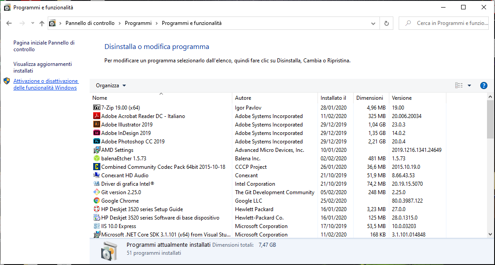
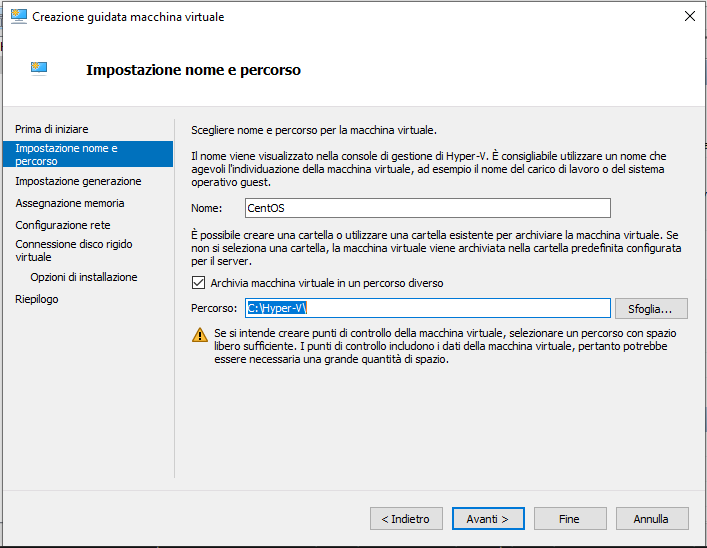
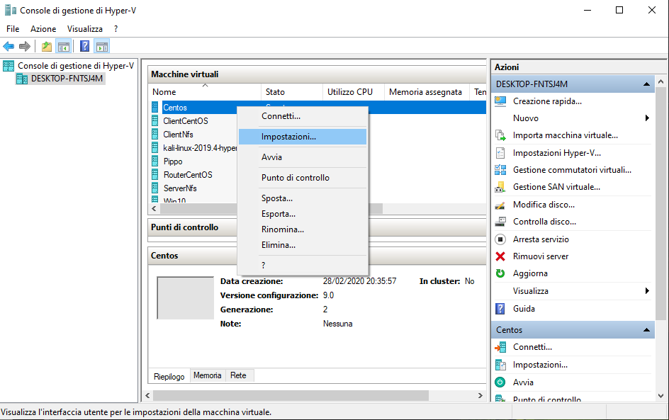
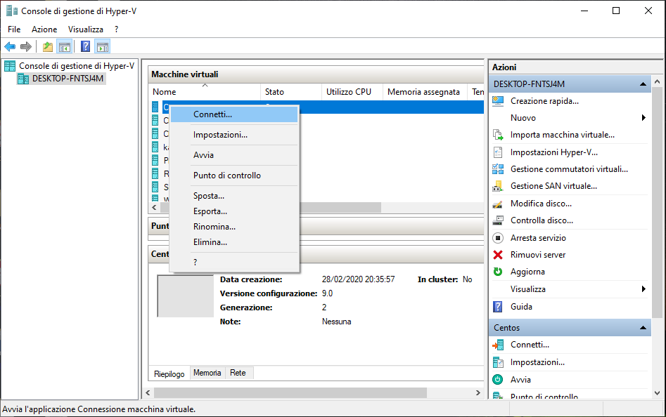

# Primi passi con Hyper-V

## Installazione Hyper-V

Ricordiamo che prima di effettuare l’installazione di Hyper-V su Windows 10, sono richiesti due parametri fondamentali: 64bit di processore e attivare specifiche proprietà Intel. Vedere [documentazione](https://docs.microsoft.com/it-it/virtualization/hyper-v-on-windows/reference/hyper-v-requirements).

Se tutto corrisponde andare su Pannello di controllo > disinstalla un programma > selezionare “Attiva o disattiva funzionalità di Windows”



selezionare “Hyper-V “> clic su “ok”. Attendere l’installazione > dopodiché verrà richiesto di riavviare. 


Si può anche usare PowerShell per abilitare Hyper-V con il comando:

```sh
Enable-WindowsOptionalFeature -Online -FeatureName Microsoft-Hyper-V -All #Installazione da PowerShell
```
[Clicca qui](https://docs.microsoft.com/it-it/virtualization/hyper-v-on-windows/quick-start/enable-hyper-v) per maggiori dettagli.

Come abbiamo già accennato, una volta installato Hyper-V il controllo dell’hardware non sarà più di Windows 10, ma direttamente del virtualizzatore Hyper-V.

## Creazione di una macchina virtuale 

A questo punto possiamo iniziare ad utilizzare Hyper-V, da cui poi installeremo il nostro sistema operativo di Linux (vedere il capitolo successivo)
Apriamo il tool di gestione: “Console di gestione Hyper-V” (o “Hyper-V manager” se è in inglese). Nel nostro caso, l’Hyper-V manager caricherà il **localhost** (nome associato all'indirizzo dell'interfaccia di loopback).

**Interfaccia di loopback**: utilizzata nelle reti TCP/IP per identificare la macchina locale su cui i programmi sono in esecuzione, detta anche localhost.


Se clicco col tasto destro il nome del localhost posso creare o importare una macchina virtuale, definire le settings di gestione, ecc. 

Ora creiamo la nostra prima macchina virtuale su Hyper-V.

Selezionare la voce di menù “Azione” > “Nuovo” > “Macchina virtuale...”


Nomino la mia macchina (“CentOS”) e metto la vm in un percorso a scelta (io la metterò nella mia cartella Hyper-V creata nel mio disco C, C:/Hyper-V) > avanti



scelgo generazione 2 (solo per questa lezione, più avanti creeremo macchine virtuali di generazione 1)

 > avanti

lasciamo 1 giga come memoria di avvio (1024MB) e il flag in “usa memoria dinamica” > avanti


come connessione scegliamo lo switch di default > avanti


diamo la dimensione del disco fisso a 4 giga > avanti


 
scegliamo l'opzione “Installa sistema operativo da un file immagine di avvio”, e inseriamo l’ISO del sistema operativo CentOS 7 (scaricabile a questo [indirizzo](http://mirror.umd.edu/centos/7/isos/x86_64/)) > fine.


Per maggiori informazioni su come creare una nuova macchina virtuale: [clicca qui](https://docs.microsoft.com/it-it/virtualization/hyper-v-on-windows/quick-start/quick-create-virtual-machine)

Facciamo presente che molto probabilmente Windows attiverà di default delle impostazioni di sicurezza che adesso noi andremo a disattivare. 

Tasto destro sulla macchina virtuale appena creata > impostazioni



sicurezza > togliere flag in “Abilita avvio protetto”.


Dopo aver fatto tutti i procedimenti, possiamo finalmente avviare la nostra prima macchina virtuale. 

Clic destro sulla macchina virtuale > connetti (e si aprirà la finestra) > avvia.




<!--
```sh
echo "Hello" # Accetta la stringa "Hello" tramite STDIN e poi la stampa a video tramite STDOUT
cat <file> # stampa a video (sempre tramite STDOUT) il contenuto del file
```

## STDIN, STDOUT, ed STDERR
- Standard input, abbreviato come `STDIN`, sono informazioni ricevute in input dal terminale tramite la tastiera o un altro device di input.
- Standard output, abbreviato come `STDOUT`, sono le informazioni mandate in output dopo che un processo è stato eseguito.
- Standard error, abbreviato come `STDERR`, è un messaggio di errore mandato in output dopo il fallimento di un processo.
> Naturalmente tutti e 3 possono essere rediretti nelle maniere descritte più in basso.

### Esempi di redirect:
- Il comando `>` ridirige lo standard **output** ad esempio verso un file. Negli esempi sotto viene utilizzato appunto per salvare delle stringhe all'interno dei files.<br>
- `>>` differisce leggermente, è un append e non una sovrascrizione totale del contenuto.


- `<` direziona lo standard **input** dall'elemento a destra e lo mette nell'elemento a sinistra. In questo caso con una cat il risultato è il medesimo


```sh
wc <file> # Word counter, produce sullo standard output un conteggio delle linee, parole e byte che costituiscono uno o più file di testo specificati
sort <file> # Stampa a video il contenuto del file, con le righe ordinate alfabeticamente
uniq <file> # Stampa a video il contenuto del file senza ripetizioni ADIACENTI tra loro (se una riga è identica alla precedente non la stampa)
grep <string> <file> # Stands for “global regular expression print”, stampa ogni riga del file dove è presente la sottostringa specificata
sed 's/<string1>/<string2>/g' <file> # Sostituisce le ricorrenze della prima stringa con la seconda all'interno di un file
history # Stampa lo storico dei comandi
```
> `grep -i <file>` rende il comando case-insensitive<br>
> `grep -R <directory>` cerca tra tutti i nomi dei file all'interno della directory e tra le righe dei file le ricorrenze. -R sta per "recursive".<br>
> `grep -Rl <directory>` -l specifica che la ricerca riguarda SOLO i nomi dei file<br>
> Per ogni comando ho utilizzato un file ma come vedremo con il reindirizzamento non è sempre un file il parametro
:::tip
Per altri dettagli sulle **regex** del comando `sed`, clicca [qui](https://www.geeksforgeeks.org/sed-command-in-linux-unix-with-examples/)
:::

- `|` è detta "pipe". La pipe prende lo standard **output** del comando a sinistra, e lo manda come standard **input** del comando sulla destra. In pratica è una redirezione "da comando a comando". 


> I comandi sono particolarmente potenti e versatili quando combinati tra loro

```sh
cat lakes.txt | sort > sorted-lakes.txt # Ordina alfabeticamente i laghi e salva il nuovo ordinamento nel file sorted-lakes.txt
sort deserts.txt | uniq # Stampa a video i nomi dei deserti ordinati alfabeticamente e senza ripetizioni
sort deserts.txt | uniq > uniq-deserts.txt  # Idem ma salva l'output in un file
history | grep <string> # Stampa ogni comando eseguito in passato con la sottostringa specificata
```


-->