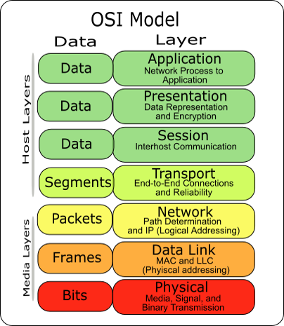

# Networking

Durante l'avvento negli anni '60 dei **mainframe** (un tipo di computer caratterizzato da prestazioni di elaborazione dati di alto livello di tipo centralizzato) e dei primi sistemi operativi, la prima cosa che si era resa necessaria fare era quella di collegare e connettere, anche perché allora c'era solamente un supercalcolatore dove magari più persone dovevano accedere a tutto il corpo lavoro. 

:::tip
Prima dell’avvio del personal computer c’erano dei **super calcolatori** e **terminali** in cui potevo gestire e lanciare del codice elaborandolo. I mainframe si collegavano coi terminali. 

Il **cloud** non è altro che un supercalcolatore in cui girano istanze e servizi non in locale. Il **cloud computing** è un paradigma di erogazione di servizi offerti on demand da un fornitore ad un cliente finale attraverso la rete Internet. Il vantaggio fondamentale del cloud è che mi posso dimenticare tutti i concetti riguardanti l’infrastruttura.
:::

Dagli anni venti agli anni cinquanta, le **schede perforate** (supporto di registrazione in cui le informazioni sono registrate sotto forma di perforazioni in codice) furono il supporto principale per l'immagazzinamento e il trattamento automatico dei dati, poi è nata l'interazione uomo-macchina coi sistemi operativi. Quindi, fino a quel momento il modello di lavoro era: un supercalcolatore in un reparto, un laboratorio di ricercatori in un altro reparto avente decine di monitor che corrispondevano a dei terminali (non a pc) e di cui io mi collegavo al supercalcolatore per lanciare le operazioni. Per fare ciò però dovevo avere la possibilità che l'input che io davo arrivasse a un mainframe che poi a sua volta ne generasse un altro che arrivasse a me. Quindi sostanzialmente dovevo interconnettere in qualche modo questi dispositivi tra di loro. Queste erano le cosiddette "reti locali", in cui io collegavo un supercalcolatore ai terminali con un raggio di azione inferiore a un chilometro. 

Le università poi si sono estese e le reti di conseguenza sono diventate delle "reti di campus", le quali sono arrivate ad avere un raggio d'azione fino a 10km. 
Successivamente queste sono diventate un tipo di rete di telecomunicazioni Metropolitan Area Network, con un'estensione limitata a un perimetro metropolitano e con raggio d'azione che arriva fino a 100km. 
Ed infine siamo arrivati all'avvento di internet e ad avere una globalizzazione che riusciva a collegarsi in tutto il mondo.

:::tip
* LAN - Local Area Network            (1 km)
* CAN - Campus Area Network     (10 km)
* MAN - Metro Area Network       (100 km)
* WAN - Wide Area Network      (1000 km)
* GAN - Global Area Network  (10000 km)
:::

Quindi, in breve, le prime reti che sono nate sono reti locali e poi con il progetto ARPANET è subentrato internet in cui finalmente il mondo si è connesso. 

A seconda della rete che c'è, cambiano anche le tecnologie e i protocolli. Questo significa che affinché ho un server web e ho una persona che si collega a un server web e riceve un output, io utilizzo la rete a tutta una serie di livelli e cavi per cui devo creare sostanzialmente un castello che parte dal livello fisico fino a salire al livello applicativo. In questo castello, suddiviso per livelli, i vari livelli devono parlare fra di loro. Per fare questo naturalmente non c'è un unico protocollo o un unico metodo, ma ho più protocolli che fra di loro vengono anche incapsulati per permettere il risultato finale. Questo modello qua si chiama **modello ISO/OSI**, il quale ha tutta una serie di standard internazionali. 

## Modello ISO/OSI

Il modello ISO/OSI è un'**architettura di comunicazione** basata su livelli (layer) con tutta una serie di caratteristiche. Questa architettura di comunicazione a livelli permette di far parlare in maniera diretta ogni livello col suo reciproco. Concettualmente questo significa che, se io collego a un cavo il segnale di livello fisico e mando il segnale dalla stazione A alla stazione B questa architettura deve permettere che il segnale sia ricevuto correttamente, ossia che il livello fisico funzioni.



Sicuramente i livelli parlano tra di loro direttamente e le entità di livello superiore si interfacciano a quelli inferiori. Quindi in sostanza ho una comunicazione a livello verticale. I livelli del modello ISO/OSI sono sette. 

In una pila di protocolli ogni livello risolve una serie di problemi che riguardano la trasmissione di dati e fornisce un ben definito servizio ai livelli più alti. I livelli più alti sono logicamente più vicini all'utente e funzionano con dati più astratti lasciando ai livelli più bassi il compito di tradurre i dati in forme mediante le quali possono essere fisicamente manipolati e trasmessi infine sul canale di comunicazione.

#### Criticità del modello ISO/OSI

E' stato sviluppato quando le tecnologie degli apparati di rete erano più inaffidabili di adesso, con questo vuol dire io ad ogni livello tutti questi controlli mi generano un ovrehead, che di conseguenza mi darà un impatto sulle prestazioni. Tanto è vero che c’è stato un dibattito che ha messo in discussione l’eccessiva complessità del modello. Si è proposto di ricostruirlo eliminando certi strati considerati superflui e di semplificarlo, oltre a rendere più indipendente ciascun livello (con un controllo più specifico dei relativi errori). Questa cosa però non è mai stata fatta. 

Ma ora passiamo in rassegna tutti i livelli.

### Livello fisico

E' il livello che sta più in basso, in cui dentro di esso ci sono i segnali elettrici che permettono di ricevere e trasmettere un flusso di dati (bit) attraverso un supporto fisico. Perciò, in breve, il livello fisico trasferisce i segnali che avranno una loro codifica e una loro potenza. La potenza è determinata anche in base alla distanza, e ci sono dei limiti anche a causa del materiale di utilizzo (ad esempio, se io utilizzo dei cavi in rame per collegare due pc avrò un certo tipo di limite, discorso differente se io ho la fibra ottica). A questo punto avrò due tipologie di mezzi trasmissivi nel mondo fisico: la parte cablata (coi cavi), che di fatto corrisponde alle infrastrutture di rete fisiche, e la parte non cablata che si riferisce al wireless. Il mondo wireless permette di trasferire il segnale nell'Ethernet.

Il livello fisico è popolato da **repeater** o **hub**.  

I **repeater** sono dispositivi elettronici che non fanno altro che ripetere il segnale. Essi ricevono in ingresso un segnale e lo ritrasmettono in uscita tipicamente con un segnale a potenza maggiore cosicché la propagazione di questo può essere garantita anche a lunghe distanze senza eccessiva attenuazione/degradazione. 

Gli **hub** sono dei concentratori, ovvero dei dispositivi di rete che fungono da nodo di smistamento dati di una rete di comunicazione dati organizzata con una topologia logica a bus e di topologia fisica a stella. Attualmente la tecnologia degli hub è considerata obsoleta, poiché largamente soppiantata dall'uso degli switch di rete, ma a differenza dello switch non fanno altro che catturare il segnale e ritrasmetterlo (ripeterlo) su tutte le porte. 

### Livello dati

Un gradino sopra al livello fisico troviamo il **livello dati**, il cui compito è quello di trasmettere i miei messaggi che vengono pacchettizzati in frame e dovrò avere tutta una serie di protocolli che mi garantiscono che il messaggio che io invio a un destinatario arrivi corretto (ossia che il messaggio non perda qualche pezzo). 

Dentro questo livello c'è un protocollo di connessione che utilizza una tecnologia di connessione in una rete locale (non c'è ip).  

C’è da dire che arrivati a questo livello c’è ancora una cosa da risolvere: laddove ci fosse una connessione a tipologia stellare e io effettuo un collegamento con un unico cavo, se mi vengono lanciati più messaggi contemporaneamente, quel cavo, in quella frazione di tempo (anche se piccola), è occupata dalla partizione del segnale, quindi di conseguenza non riesco a trasmettere. Questo significa semplicemente che ci saranno delle soluzioni per ritrasmettere il messaggio che voglio inviare, perché non ho un numero di risorse corrispondente al numero di utenti. Infatti tutto il mondo di internet ha un numero di risorse fisiche inferiore al numero di utilizzatori. Quindi a ogni livello, a ogni protocollo, e a ogni applicazione avrò delle soluzioni per definire quella che si chiama contesa.

Quindi, ricapitolando, nel livello fisico ci sono i segnali e i livelli trasmissivi che possono essere diversi a seconda della necessità, dell'esigenza e della velocità, la quale dipende anche dal livello fisico (ad esempio posso avere dei cavi che arrivano fino a 10MBit al secondo, cavi a 100, cavi a 1 giga, posso avere delle soluzioni a fibra ottica per arrivare 10 o 100 giga). L'importanza di queste trasmissioni, è che la potenza sia inalterata, perché se io ho una perdita di potenza iniziale non ho la garanzia che un messaggio che invio a un destinatario venga ricevuto correttamente. Più sopra c'è il livello dati che controlla i segnali del livello fisico, li trasmette e li riceve. Quindi i miei byte di informazione li devo imbustare in dei frame, inviarli sul canale trasmissivo, trovare un meccanismo affinché il messaggio che invio arrivi integro, e laddove il mezzo trasmissivo è già in utilizzo in quel lasso temporale trovare dei meccanismi per ritrasmetterlo.

### Livello rete

Il livello rete è il livello superiore a quelli sopra citati. Questo livello lo possiamo associare al livello internet. Il livello rete è il mondo dell'**indirizzo IP**, che tramite di esso due pc hanno la possibilità di parlarsi anche a lunga distanza. Questo livello deve garantire che la comunicazione tra un luogo e l'altro (end-to-end, ossia tra due postazioni) possa essere instradata nel mondo, quindi per arrivare al destinatario ci sarà tutta una serie di protocolli di instradamento gestiti da dei dispositivi che si chiamano router. 

Se vogliamo semplificare tutto il discorso affrontato finora, il livello dati corrisponde a livello fisico a dei dispositivi che si chiamano switch. Quindi in realtà lo switch non sa neanche cosa sia un indirizzo IP (è un apparato di rete), ma parla e traferisce i frame e i messaggi (non col l'IP) con un qualcosa che si chiama **MAC address** (il cosiddetto indirizzo fisico), cioè identifica le stazioni con una stringa esadecimale.  

Nel mondo delle reti locali (quindi nel mondo Ethernet) le macchine vengono identificate attraverso un MAC address, ossia una stringa esadecimale (che, a differenza degli IP, viene configurata manualmente sul proprio pc o assegnata attraverso il provider) assegnata in modo univoco dal produttore ad ogni scheda di rete ethernet o wireless attraverso una convenzione internazionale, tuttavia modificabile a livello software. Il Mac address è responsabile delle funzionalità di verifica dell'accesso al mezzo fisico, funzionalità di framing e check degli errori.

Il **protocollo ARP** (Address Resolution Protocol) serve per conoscere il MAC address, una volta noto l’indirizzo IP di destinazione. 

Le coppie IP-MAC vengono mantenute da ogni Host in una tabella in RAM, detta “tabella ARP” o “ARP cache” (dato che si svuota a tempo). Questa tabella offre una corrispondenza di indirizzi IP e indirizzi che lui chiama arlem, essa è importante perché quando nel linguaggio Ethernet vado a parlare con un IP, lo switch si frappone, vede dove c’è un campo destinazione e a chi è rivolto, e costruisce un canale virtuale di comunicazione tra una porta e l’altra. 

Io quindi ho due vantaggi in questi sistemi: il primo è il fatto che garantisco una riservatezza end-to-end fra comunicazioni, il secondo è che garantisco anche più performance (è tutto più ottimizzato e veloce). Quindi l’evoluzione degli switch è questa. 

In tutto questo gioco di stacchi, incapsulamento e apertura dei pacchetti (dei frame) io inserisco due cose importanti: il contenuto, ossia i bit che rappresentano il contenuto, l’indirizzo sorgente e l’indirizzo destinazione. Quando costruisco un frame Ethernet il sorgente della destinazione è il Mac Address, a sua volta, quando raggiungerò il livello IP, inserirò l'indirizzo IP. Quindi le informazioni variano a seconda del livello. 

Ricapitolando, con il livello rete io ho due pc che si collegano a uno switch e parlano in rete locale. Il livello rete invece è governato a livello fisico a dei dispositivi che si chiamano router. 

Il **router** è un dispositivo che non ha come compito il fatto di collegare direttamente due dispositivi tra di loro, ma quello di instradare (dirottare il traffico, ossia i segnali o pacchetti) verso la destinazione intermedia corretta (che ovviamente fa parte del pacchetto inviato)<!--per arrivare fino in rust. -->. Ad esempio, se io ho un pc A e un pc B collegati tra loro da uno switch, il protocollo a livello dati utilizzerà dei meccanismi di identificazione della postazione destinataria di un certo tipo e il pacchetto partirà da A in B in maniera molto diretta. Se io ho il mio router che collega A e B, non ci sarà un collegamento diretto tra A e B con un solo apparato di rete, ma in base all'IP di destinazione il router non farà altro che instradare l'informazione sul router che considera idoneo per quella destinazione finale che lui non conosce direttamente. Questo meccanismo qua si chiama op, in cui si creerà una sequenza di op tali per cui, dopo alcune centinaia di router, il mio messaggio arriverà a destinazione finale. 

Quindi naturalmente ci saranno dei protocolli che calcoleranno anche il percorso. E' importante sapere che non c'è una sola strada che connette A e B, ma io avrò bensì più strade. Quindi i dispositivi router avranno questi protocolli di instradamento che calcolano in tempo reale il percorso migliore, più efficiente e più veloce in base a dei protocolli (protocolli di routing) che possono essere sia statici, in cui possono definire delle rotte statiche per cui viene seguito un solo percorso, oppure dinamici, ossia che i collegamenti variano durante il tragitto del percorso a seconda delle condizioni reali di traffico e di banda. 

Queste reti ridondate si chiamano reti baiate e internet è nato dal famoso progetto ARPANET che doveva originariamente garantire la comunicazione tra stati diversi all'interno del territorio americano anche a fronte di un attacco nucleare. Questo significa che io riesco a comunicare a lunga distanza anche a fronte di guasti parziali. Quindi c’è una forte ridondanza (come abbiamo una forte ridondanza dei server, avremo anche una forte ridondanza delle reti) in cui questi protocolli si riconfigurano anche in caso di guasti. 

Altra caratteristica di internet è il fatto che questa si basa su un concetto di "best reports", che vuol dire che il numero di risorse che io ho a disposizione per parlare a un altro capo del mondo è inferiore rispetto agli utilizzatori e soprattutto non c'è nessuna garanzia che il messaggio arrivi. Quindi nessuno garantisce niente, eppure in larghissima parte tutto funziona. In breve, contengo le risorse e nessuno mi garantisce che qualcosa arrivi, e infatti non garantisce necessariamente affidabilità nella processione.

### Livello di trasporto

Sopra il livello rete c'è quello che si chiama livello di trasporto. Questo livello deve sostanzialmente garantire un'affidabilità, quindi se io ho il livello di struttura che non mi garantisce un'affidabilità cerco di riportarlo al livello superiore quanto meno a fronte delle critiche. Laddove mi accorgo che il mio pacchetto sorgente è stato modificato nel completo, ci saranno dei meccanismi di ritrasmissione. Questa ritrasmissione la ritroviamo sia nel secondo livello (livello dati) sia nel quarto livello (livello di trasporto). 

Quindi se il livello rete lo abbiamo identificato come mondo IP, il livello di trasporto lo possiamo identificare come mondo TCP. La somma dei due mondi si chiama **TCP/IP**. 

Il **TCP** è associato al livello di trasporto e il suo compito è traferire informazione nel web. In realtà oltre al TCP ho un altro protocollo che si chiama UDP. La differenza tra TCP e UDP è che per tutte le applicazioni (ad esempio applicazioni web come posta elettronica e quant'altro) si utilizza sempre il protocollo TCP che garantisce semplicemente una cosa: la ritrasmissione e la verifica dell'integrità. La scelta del tempo massimo di attesa per la ritrasmissione è complicata ulteriormente dal fatto che Internet connette fra di loro reti molto diverse, ognuna delle quali può essere formata da mezzi di comunicazione che supportano diverse velocità di trasferimento dati. Quindi il TCP non utilizza un valore fisso come tempo massimo di attesa, ma sceglie questo valore come metodo adattivo. 

L'**UDP** invece viene utilizzato per applicazioni particolari che non hanno le ritrasmissioni per questioni di velocità. Quindi se voglio inviare un messaggio e questo voglio che venga trasmesso nel più breve tempo possibile (tipo di trasmissione veloce e concorrente), utilizzo UDP (anche se ci sono più probabilità che questo non arrivi correttamente, a differenza di quando utilizzo il protocollo TCP).

### Livello sessione

Il livello che si trova subito dopo il livello trasporto, è il **livello session**, il quale organizza (sincronizza tiene traccia delle comunicazioni correnti) il dialogo tra due sistemi coinvolti. Il altre parole, gestisce il dialogo end-to-end tra due programmi applicativi che debbono comunicare.

Il dialogo tra due sistemi deve garantire la mutua esclusione nell'utilizzo di risorse condivise, intercalare domande e risposte garantendo la consequenzialita'

Con la sincronizzazione deve stabilire punti intermedi nella comunicazione rispetto ai quali entrambe le parti abbiano la garanzia che quanto accaduto "prima" sia andato a buon fine.

Molte applicazioni non sfruttano neanche questo livello.

### Livello presentazione

Subito dopo a il livello session abbiamo il **livello presentation**, il quale fornisce importanti funzioni come la compressione e la confidenzialità, ossia permette che le informazioni siano rappresentate in maniera comprensibile.

Il suo compito è quindi quello di gestire la sintassi dell'informazione lungo l'intero percorso end-to-end, convertendo l'uno nell'altro i vari formati.

### Livello applicazione

L'ultimo livello della pila ISO/OSI è il **livello applicazione**, che non è altro che l'output di un input che io trasmetto e viceversa. Quindi se utilizzo la posta elettronica e per inviare una mail utilizzo un protocollo che si chiama SMTP (che fa parte ovviamente del TCP, il quale permette la ritrasmissione) dovrò avere nel mio pc un programma per leggere la posta elettronica con i protocolli di questa. Questi protocolli riguardano il livello applicazione e il programma che utilizzo è nel client. Io ovviamente spedisco tutte le informazioni nel server e poi il destinatario si interfaccia nel client per scaricare la posta elettronica e sincronizzarsi col server. Il senso è che nel livello applicativo ho delle applicazioni che vengono coadiuvate coi sistemi operativi (interfaccia uomo-macchina) affinché io abbia ogni informazione che mi è stata trasmessa.

Ho dunque le mie applicazioni e i miei programmi che mi permettono di ricevere o tramettere le informazioni che io voglio coprire via rete incapsulandole del protocollo corretto. Ad esempio, se io uso l'Outlook per la posta elettronica, nel momento in cui faccio "Send" utilizzerò dei protocolli che sono diversi rispetto a quelli utilizzati quando faccio una semplice ricerca su Google. Nel caso di Google utilizzerò il protocollo HTTP, nel caso della posta elettronica utilizzerò il protocollo IMAP o POP3 per ricevere e SMTP per inviare. Ma la complessità notevole dietro ha l'obbiettivo di astrarre le cose in maniera tale che io possa utilizzare le mie applicazioni senza la necessità di conoscere i protocolli che ci stanno dietro. 

:::tip
Naturalmente con tutti questi concetti non avrò una garanzia di prestazioni assoluta, ma da ciò che utilizzerò avrò un certo tipo di prestazioni che avranno un proprio limite.
:::

### Relazioni tra ISO/OSI e i protocolli sopra citati

Abbiamo la parte network che in realtà è governata da una tecnologia che si chiama Ethernet (che avrà a sua volta ampie caratteristiche) poi abbiamo il mondo UDP, il mondo TCP e poi la parte applicazione.

#### Telnet

**Telnet** è un protocollo di accesso dove inserisco l'indirizzo IP di un server e poi questo mi chiede uno user e una password per un accesso remoto. Il telnet ormai è stato superato da quello che sia chiama SSH, la differenza tra le due cose è che per quest'ultimo ho un canale in chiaro e più sicuro, mentre nel caso del Telnet ho un canale circolato.

Quindi ogni protocollo si differenzia rispetto al reale utilizzo. Perciò ci saranno protocolli più efficienti per fare trasferimento dati, protocolli più efficienti in termini di visualizzazione delle pagine come la parte HTTP, ecc. 

#### SSH
L'**SSH** è un protocollo di accesso remoto, ossia mi permette di fare un collegamento remoto a un server. Tanto è vero che lo stesso SSH mi chiede a chi mi voglio collegare e la discriminante è che fornisco l'indirizzo IP del server di destinazione.

L'indirizzo IP mi permette quindi di collegarmi a una macchina, cioè per capire a quale macchina deve atterrare io dovrò fornire uno specifico indirizzo IP. Quindi io faccio una SSH a uno specifico indirizzo IP, dopodiché questo mi darà l'accesso applicativo. 

Sotto l'IP ho la mia parte network. Quindi io faccio la chiamata con l'IP e questo genera l'utilizzo a vari strati verso le tecnologie e protocolli che vengono chiamati in causa sempre.

#### Protocollo CSMA/CD

Il **protocollo CSMA/CD** consente ad un computer di utilizzare la rete Ethernet soltanto se nessun altro elaboratore la sta già utilizzando. 

Ethernet è in grado di gestire le contese. Dunque se il bus viene utilizzato, indipendentemente dalle capacità dello switch di selezionare in maniera selettiva chi parla, io posso avere delle situazioni in cui devo avere il meccanismo di ritrasmettere una comunicazione che è stata interrotta a causa di un canale occupato. Per questa situazione si occupa il protocollo CSMA/CD, il quale riconosce le collisioni (ossia riconosce la situazione in cui io mando un segnale che poi viene respinto) e ed è in grado di ascoltare il bus per capire se io posso inviare il pacchetto e ritrasmetterlo dopo alcuni secondi senza impedimenti.

:::tip
In qualunque livello opero in informatica, dovrò sempre garantire una cosiddetta ridondanza, la quale consiste nella duplicazione dei componenti critici di un sistema con l'intenzione di aumentarne l'affidabilità e la disponibilità.
:::

## Network

La rete è un insieme di sistemi per l’elaborazione delle informazioni messi in comunicazione tra loro. Si possono classificare per estensione (LAN, WAN, MAN) e tipologia (reti a stella, ad anello o a bus):

#### Reti a stella

Le **reti a stella** sono le più comuni topologie di rete e comprendono molti collegamenti punto a punto che si irradiano dall’apparato centrale. Questa topologia di rete consiste in un hub o switch che funge da punto centrale per la trasmissione delle informazioni e ogni host è connesso a tale punto (hub/switch). I dati all'interno di una rete a stella attraversano l'hub prima di arrivare a destinazione. Inoltre l'hub gestisce e controlla tutte le funzionalità della rete (funziona anche come ripetitore per il flusso di dati). Oramai tutti i cablaggi sono stellari, in cui collego gli switch con i dispositivi in base all’utilità. I dispositivi collegati in una rete a stella possono essere aggiunti o rimossi facilmente senza disturbare il resto della rete.


#### Reti ad anello

Vecchio modello che veniva utilizzato da altre tecnologie di reti locali (che non era Ethernet, ma un esempio può essere LAN Token Ring). Le reti ad anello sono caratterizzate da un anello continuo che passa attraverso ogni dispositivo. Questo assicura che i segnali provenienti da un dispositivo siano visti da tutti gli altri dispositivi sull’anello. In un anello semplice, un’interruzione in una parte della rete causata da un guasto o da un intervento di manutenzione del sistema, disabiliterà l’intero sistema stesso. C’è da dire che realizzazioni più avanzate hanno ampiamente superato questo problema.


#### Reti a bus

La **rete a bus** collega i dispositivi per tutta la lunghezza del cavo che è, essenzialmente, un collegamento per trasmissione ad alta velocità. I dispositivi possono essere rimossi dal bus senza disabilitare il resto del sistema. L’Ethernet è un esempio di rete a bus.


### Network Devices

#### HUB

L'**HUB** (che opera al livello 1 del modello OSI) permette la connessione di multipli dispositivi Ethernet tra loro creando un segmento di rete. Il segnale in input delle porte di un HUB viene trasmesso in output su tutte le porte eccetto la porta da dove il segnale è stato ricevuto

E’ di fatto un ripetitore del segnale in ingresso che non introduce nessun tipo di calcolo per migliorare il traffico di rete. 

Ad oggi sono dispositivi che difficilmente possiamo trovare se non in vecchie installazioni perché sono stati soppiantati dagli Switch

#### Switch

Evoluzione degli HUB che introduce componenti di calcolo che permettono una miglior gestione del traffico di rete. L’instradamento delle Frame in output avviene alla sola porta di destinazione e non a tutte le porte come negli HUB

Tramite i MAC Address all’interno degli Header L2 delle Frame sono in grado di determinare verso quale porta di destinazione il pacchetto deve essere instradato. 

## Parte strutturata

Vediamo ora come si progettano le reti, essendoci anche qua degli standard. 

Il **cablaggio** è l'insieme dei collegamenti e impianti fisici (cavi, connettori, permutatori, infrastrutture di supporto) che permettono l'interconnessione tipicamente nell'ambito di un edificio o un gruppo di edifici per la realizzazione di una rete. 

#### Cablaggio in rame

I cavi in rame basano il loro funzionamento sulla propagazione, per induzione, di segnali elettrici.
Ci sono degli strumenti di certificazione che garantiscono che il cavo di rame non abbia delle interruzioni, che il segnale arrivi pieno e che dichiari la velocità che il segnale può raggiungere. Quindi la velocità che può raggiungere un segnale trasmesso attraverso un cavo di rame, dipende dalla categoria del cavo di rame stesso. Quindi, in base alla categoria, ci sono determinate caratteristiche fisiche del cavo.

#### Cablaggio in fibra ottica

La fibra ottica è composta da materiali vetrosi o polimerici, realizzati in modo da poter condurre al loro interno la luce (onde dielettriche), in altre parole basano il loro funzionamento sull’ elettromagnetismo.
Rispetto ai cavi in rame si potrebbero riassumere nel seguente modo le migliorie introdotte dalla fibra ottica: migliore qualità del segnale, maggior throughput, perdite di segnale limitate, bassa attenuazione, altra resistenza alle interferenze elettriche, minor peso a pari quantità di cavi e minor ingombro.

## Configurazione di una rete

Una rete per essere configurata ha bisogno di:

La **Netmask**: una maschera di bit che identifica gli altri nodi che ci sono nella rete.

Il **Default Gateway**: equivale all’indirizzo IP dell’interfaccia del router.

Il **DNS server**: un database che contiene il mappaggio tra gli indirizzi IP ed i relativi nomi degli host

Per configurare automaticamente la rete agli host esiste un servizio chiamato DHCP.

```sh
ipconfig /all #comando su piattaforma Windows per vedere i parametri di rete
```