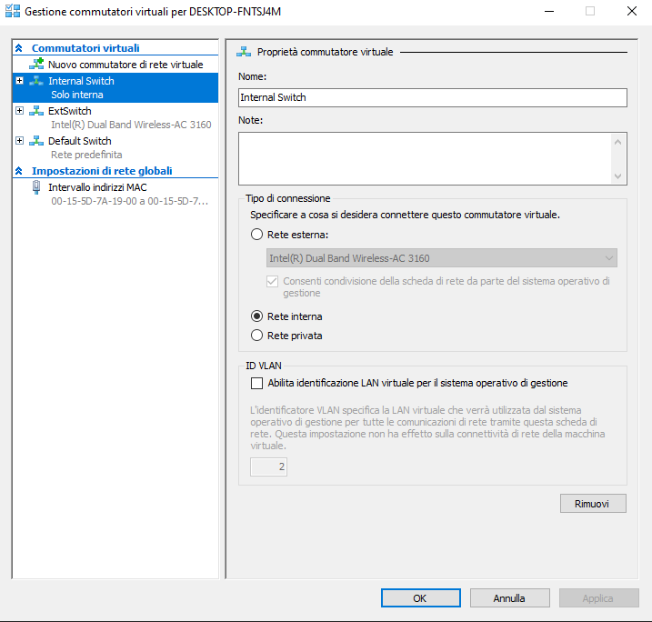

# Servizio NFS su Server e su Client

In queste due macchine create nel precedente [laboratorio](../lab-vm-nfs.md) dovremo installare il servizio Nfs sia nella parte server che nella parte client e poi permettere la riconfigurazione della rete. Dovremo quindi installare i pacchetti necessari, e dopo che questi sono stati installati costruiremo un nuovo switch privato e ricollegheremo le macchine associando gli IP statici. 

Nelle reti moderne si tende ad usare il servizio DHCP, che è un servizio di rete che permette sostanzialmente ad un computer che deve connettersi ad una rete locale di configurare automaticamente i parametri necessari. 

#### NFS (Network file system)
Uno dei primi protocolli che permettono l’esposizione del file system remoto sulla macchina. Quindi io posso montare una directory nella macchina remota (quello che faremo nel laboratorio). Quindi l'Nfs verrà installato e CentOS utilizza la gestione ai pacchetti con i nuovi meccanismi che permettono la gestione dei pacchetti (comando yum: installa i pacchetti con tutte le dipendenze).

:::warning
Prima di eseguire un qualsiasi tipo di installazione verificare la connessione a internet da parte della macchina
:::

Prima di procedere con le installazioni dei pacchetti, si consiglia di effettuare prima un update sul sistema operativo di macchina appena installata.

```sh
yum install update #comando che fa un update globale sulla macchina (appena viene installato CentOS su una nuova VM è raccomandabile digitare questo comando) 
```
Ora vediamo come installare l'nfs.

```sh
yum install nfs-utils #comando che installa il servizio Nfs 
```
:::tip
L'Nfs sarà da installare sia sul server che sul client. 
:::

Una volta finita l’installazione del Nfs avrò la fase di verifica dei pacchetti, ovvero se questi sono stati installati correttamente nel sistema operativo.

Purché l'nfs funzioni, dovremo modificare le impostazioni TCP/IP della scheda di rete per definire tutto questo. Poi, una volta che avremo fatto questi passaggi, spengo le due macchine, costruisco un nuovo switch e lo ricollego. 

In pratica, adesso dovrò modificare l’indirizzo IP staticamente che al momento ce l’ho dinamico (perché assegnato da un DHCP server) 

## Configurare l'IP del ServerNfs e del ClientNfs 

Accedere in root con la password impostata durante l'installazione del sistema operativo. 

:::warning
Le seguenti operazioni vanno svolte su entrambi i sistemi installati sulle macchine, inoltre verranno specificate quali impostazioni andranno inserite nel server o nel client. 
:::

Prima di tutto spostarsi nella cartella che contiene il file di configurazione che dovremo modificare

```sh
cd /etc/sysconfig/network-scripts/ #comando per spostarsi nella cartella network-scripts
```

Ora aprire il file di configurazione della mia scheda di rete (abilitata all’avvio)

```sh
vi ifcfg-eth0 #comando per aprire il file ifcfg-eth0
```

Ora modifichiamo le impostazioni del file di configurazione che abbiamo appena aperto

Per il server:

```
BOOTPROTO=none #ci penserà qualcun altro a darmi l’ip, non il dhcp  
IPADDR=192.168.10.100 
NETMASK=255.255.255.0  
```

Abbiamo modificato il bootproto e aggiunto altre due righe per inserire l'indirizzo ip e la Netmask.

**Netmask**: è uno strumento che fa capire al sistema dove finisce la rete locale. lo stato del sistema operativo farà un’operazione matematica ogni volta per capire se mandare i pacchetti con gateway o non mandarli. Con la netmask ottengo quindi un valore. 

Per il client:

```
BOOTPROTO=none 
IPADDR=192.168.10.10 
NETMASK=255.255.255.0  
```

A questo punto salviamo il file di configurazione del server e del client, quindi digitiamo i tasti:
ESC + shift: + wq!

:::tip Un po’ di comandi di linux

cd (change direcory) => per spostarsi tra le cartelle e cambiare la Working directory 

vi => vi è un editor di Linux. Dando il comando vi nomefile andiamo ad aprire l'editor vi per editare il file specificato (in formato testo, non binario) 

Per i comandi base di linux vedere [link](https://cocky-visvesvaraya-7b4984.netlify.com/)
:::

:::tip Tasti che effettuano determinate operazioni: 

i => (insert) comando per inserire dei dati in input 

ESC + shift: + wq! => per salvare e uscire dal file (w = write, q = quit) 
:::

In ogni sistema operativo, a livello di indirizzamento IP avremo 4 parametri: Indrizzo IP, Netmask, Gateway e DNS. 

**DNS**: servizio che permette, da una risoluzione simbolica, di andare all’IP del server 

L’indrizzo IP, la netmask, e il gateway permettono invece di definire un istradamento. La netmask permette di definire quello che è il dominio di pertinenza. 

Una volta modificato il file di configurazione della scheda di rete, spengo le macchine, torno su Hyper-V e creo un altro virtual switch che chiamiamo Internal Switch (prima seleziono il tipo e poi lo creo) > scegliere “Rete interna” > apply e poi crea



Poi vado sulle impostazioni di entrambe le macchine virtuali e cambio lo switch (dall’External Switch all’Internal Switch).  


Riaperte le macchine, sull’interfaccia di CentOS utilizzo il mio comando ping, e provo a pingare sul mio switch. Dovrebbe funzionare tutto.  

**Ping**: è un comando usato per misurare il tempo, espresso in millisecondi, impiegato da uno o più pacchetti ICMP (protocollo di servizio per reti a pacchetto che si occupa di trasmettere informazioni riguardanti malfunzionamenti) a raggiungere un dispositivo di rete basata su IP e a ritornare indietro all'origine. Quindi verifico se c’è continuità. 

Una volta che c’è continuità, andranno modificati i file di configurazione dell’nfs, per poi dal client montare automaticamente la cartella che corrisponde alla partizione che abbiamo creato all’installazione di CentOS (/datinfs).

[Clicca qui](../nfs-utilization/README.md) per proseguire con l'installazione del servizio NFS sulle macchine